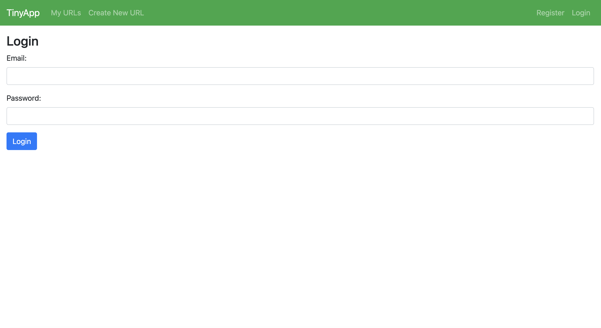
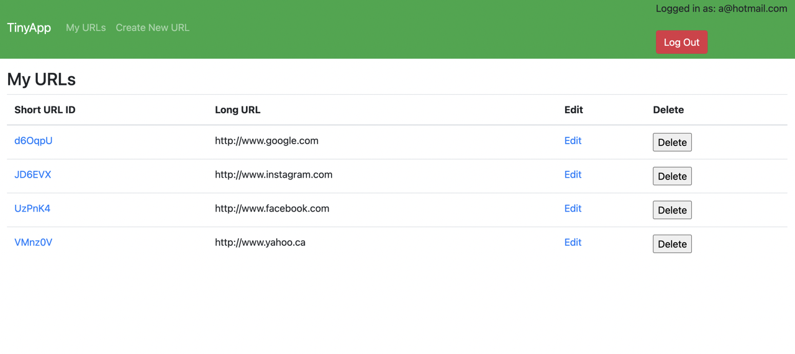

# TinyApp for LHL

TinyApp is a full stack web application built with Node and Express that allows users to shorten long URLs (à la bit.ly).

## Purpose

This project was created and published by me as part of my learnings at Lighthouse Labs.

## User Interface

The login page

 

The urls page

**Dependencies**

- Node.js
- Express
- EJS
- bcrypt
- cookie-session

## Getting Started

1. Install all dependencies (using the npm install command).
2. Run the development web server using the node express_server.js command.
3. Register as a new user.
4. Start creating your own personal library of short URLs.
