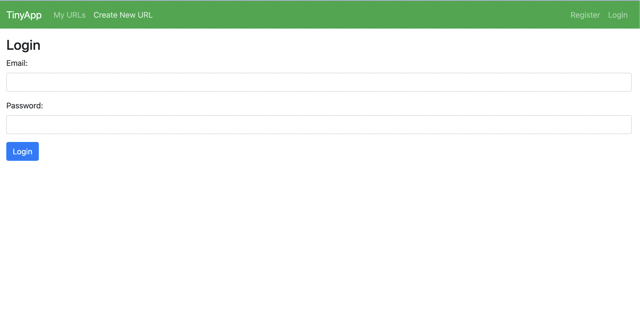

# TinyApp for LHL

TinyApp is a web application built with Node and Express that allows users to shorten long URL's

# Purpose

This project was created and published by me as part of my learnings at Lighthouse Labs.

## UI

This is the login page

 

This is the urls page

**Dependencies**
Node.js
Express
EJS
bcrypt
cookie-session

## Getting Started

Install all dependencies (using the npm install command).
Run the development web server using the node express_server.js command.
Register as a new user.
Start creating your own personal library of short URLs.
